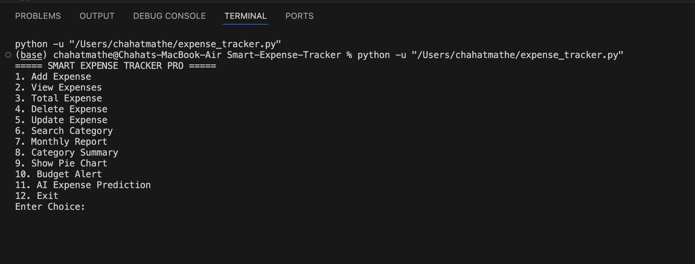
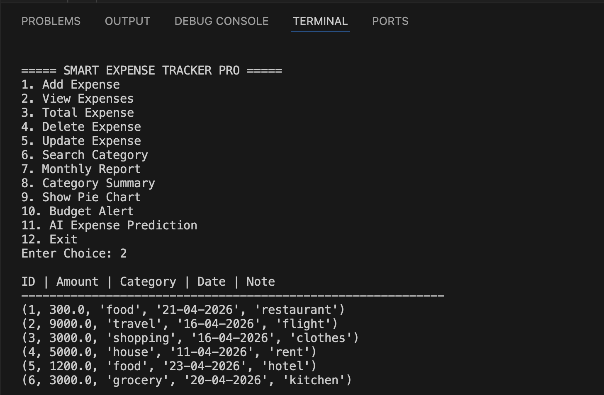
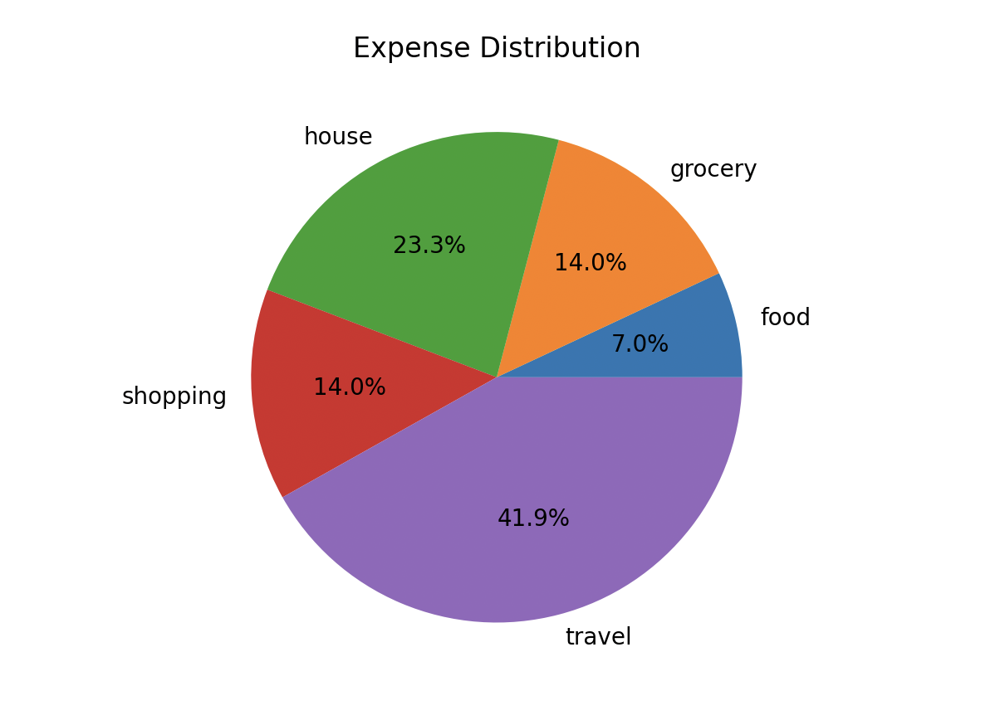

#smart-expense-tracker

AI-powered Expense Tracker built using Python, SQLite, Charts, and Machine Learning Prediction.

---

## Features

- Add new expenses
- View all expenses
- Update expense records
- Delete expenses
- Search expenses by category
- Monthly expense report
- Category-wise summary
- Pie chart visualization
- Budget alert system
- AI-based next month expense prediction

---

## Tech Stack

- Python
- SQLite
- Matplotlib
- Scikit-learn
- NumPy

---

## Project Structure

Smart-Expense-Tracker-python/
│── expense_tracker.py
│── README.md
│── .gitignore

---

## How to Run

1. Install Python  
2. Install required libraries:

## Screenshots

### Main Menu

### Expense Records

### Expense Chart

pip install matplotlib scikit-learn numpy

Run the project:
python expense_tracker.py

Future Enhancements
GUI Version using Tkinter
Web App Version using Flask
User Login System
PDF/Excel Report Export
Cloud Deployment
Learning Outcomes

This project helped me learn:

Python programming
Database integration using SQLite
CRUD operations
Data visualization
Basic Machine Learning implementation
Problem solving through real-world application building
