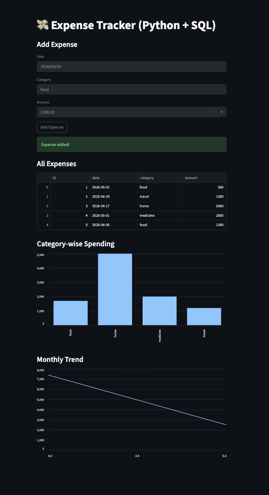
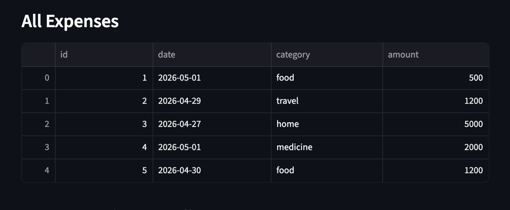
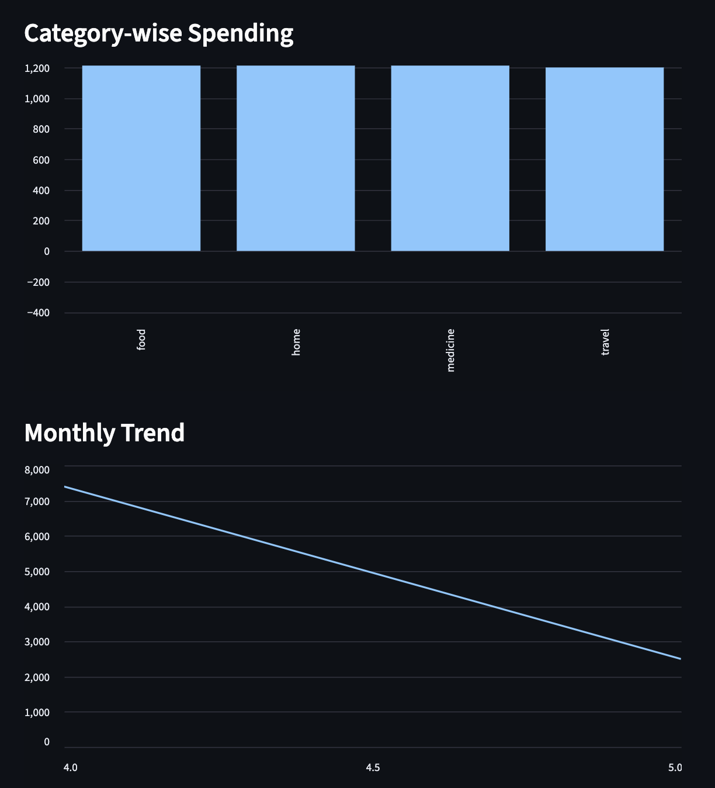

# 💸 Expense Tracker with Python-SQL Integration

## 🚀 Overview
A Python-based expense tracking application that stores financial data in MySQL and generates real-time insights.

## 🔗 Project Integration
This system acts as the **data collection layer** for the Data Warehouse Analytics System, where collected expense data is further analyzed and used for visualization and prediction.

## 📊 Data Flow
Expense Tracker → MySQL → Data Warehouse Analytics System → Dashboard + ML Predictions

## 🛠️ Tech Stack
- Python (Pandas)
- MySQL
- Streamlit

## 📊 Features
- Add and store expenses in MySQL
- View all transactions
- Category-wise spending analysis
- Monthly trend visualization
- Budget tracking system

## ▶️ Run Locally
pip install -r requirements.txt  
streamlit run app_streamlit.py

## 📸 Output

  
  

